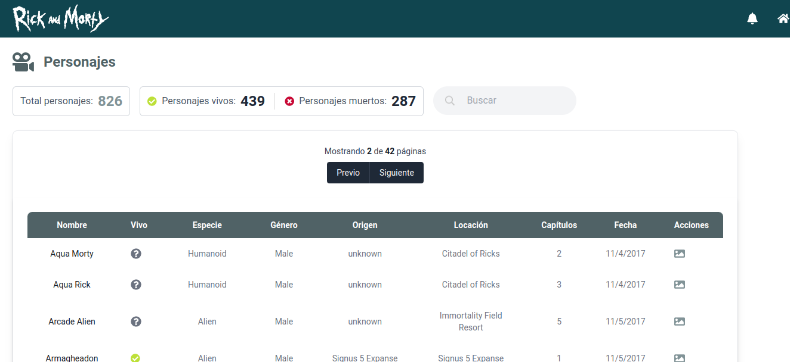
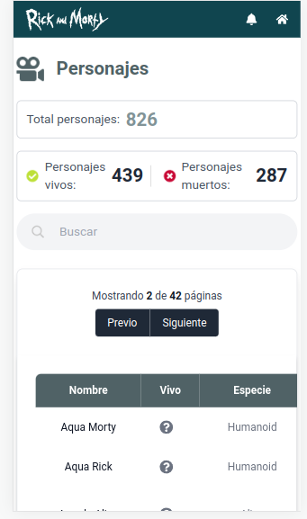

# Frontend Mentor - Skilled e-learning landing page solution

This is a solution to a technical test that was put to me using the Rick and Morty API. The design was supplied as a file.

## Table of contents

- [Overview](#overview)
  - [The challenge](#the-challenge)
  - [Screenshot](#screenshot)
  - [Links](#links)
- [My process](#my-process)
  - [Built with](#built-with)
  - [Continued development](#continued-development)
- [Author](#author)
- [Acknowledgments](#acknowledgments)

## Overview

### The challenge

Users should be able to:

- View the optimal layout depending on their device's screen size
- Filter and view character information provided by the API.

### Screenshot

### Links

- Solution URL: [GitHub Repo](https://github.com/jisazamp/rick-and-morty)
- Live Site URL: [Netlify preview](https://jpi-rickandmorty.netlify.app/)

## My process

### Built with

- HTML5 markup
- CSS custom properties
- Flexbox
- CSS Grid
- Mobile-first workflow
- [React](https://reactjs.org/) - JS library
- React Context API for State Management
- [TailwindCSS](https://styled-components.com/) - For styles

### Continued development

There is code that needs to be refactored, but it was an exercise that was done in half a day so I am very happy with the results.

## Author

- Website - [Juan Pablo Isaza](https://www.github.com/jisazamp)
- Frontend Mentor - [@jisazamp](https://www.frontendmentor.io/profile/jisazamp)

## Acknowledgments

The resources and designs used are not of my authorship, they were provided by the company.
